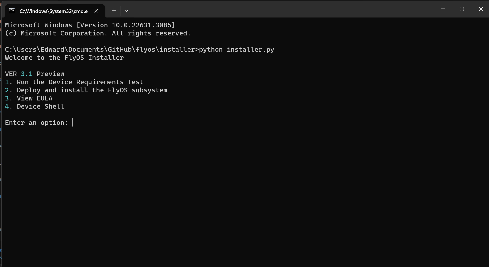
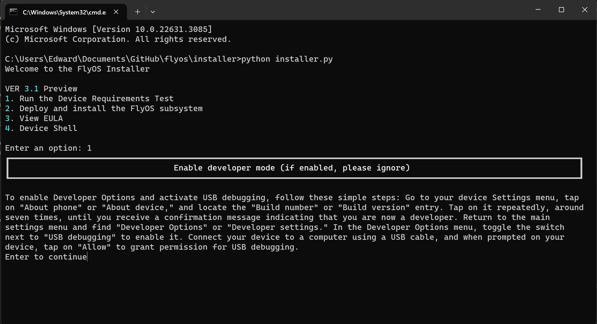
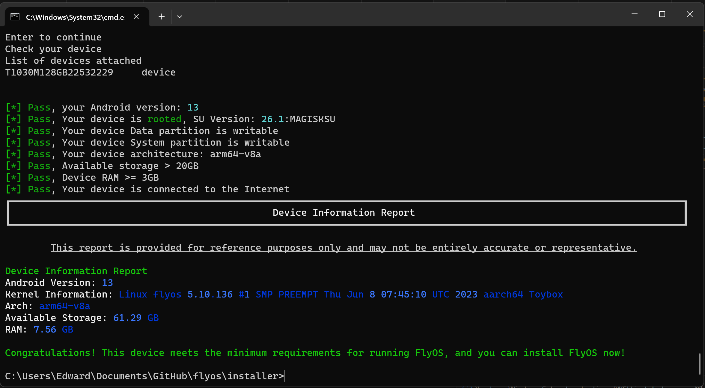
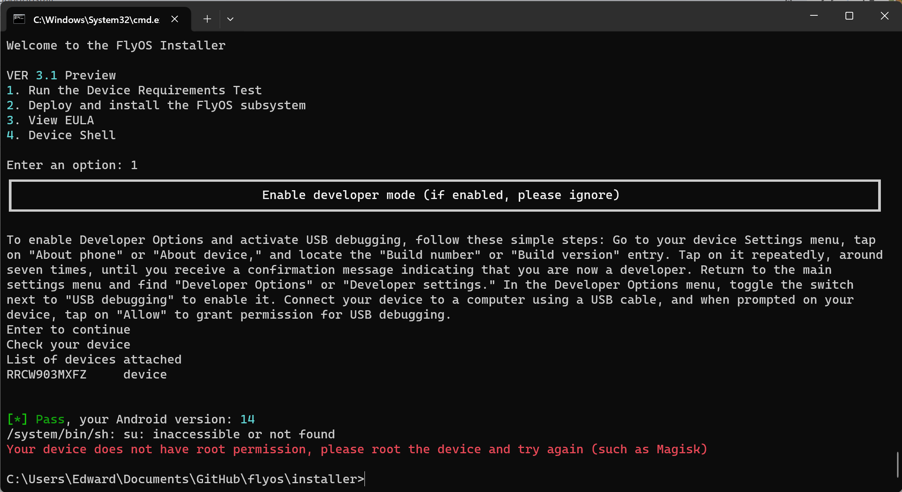

import Callout from 'nextra/components/Callout';
import Tabs from 'nextra/components/Tabs';

# Install FlyOS

## Install "FlyOS Installer" on your PC

There are two ways to run the FlyOS Installer:    
 
<Tabs items={['Packaged installer (Fastest)', 'Python Script Installer']}>
  <Tabs.Tab>
### Packaged installer (Fastest)
Support [Windows only] currently   
Recommended if you do not have Python environment
[Download Packaged Installer](https://github.com/DigitalPlatDev/FlyOS-Installer)

  </Tabs.Tab>
  <Tabs.Tab>
### Python Script Installer
Support [Windows, Linux, MacOS]    
If you Installed Python environment, so you can directly download the installation script, install the requirements libraries and just run the script
#### Install requirements and run
```bash filename="Script" copy
cd <Installer directory>
pip install -r requirements.txt
python installer.py
```
  </Tabs.Tab>
</Tabs>


export const Tips1 = () => {
return (
    <Callout type="info" emoji="ℹ️">
    You need to install Python3 and pip first. Some systems need to replace pip, python to pip3, python3 if pip command not found. See Python document.
    </Callout>
  );
};

<Tips1/>


## Run the Device Requirements Test

export const Tips2 = () => {
return (
    <Callout emoji="💡">
    To make sure that FlyOS is working and installing properly, we need to perform a requirement test before installation
    </Callout>
  );
};

<Tips2/>

### Turn on Turn on USB debugging (ADB)


#### On your device
In Android document:    
Enable USB debugging in the device system settings under Developer options. You can find this option in one of the following locations, depending on your Android version:    

Android 9 (API level 28) and higher: Settings > System > Advanced > Developer Options > USB debugging    
Android 8.0.0 (API level 26) and Android 8.1.0 (API level 27): Settings > System > Developer Options > USB debugging    
Android 7.1 (API level 25) and lower: Settings > Developer Options > USB debugging    
### Test Passed
If the test passes, you can proceed with installing FlyOS

```text filename="Test Result" copy
Check your device
List of devices attached
T1030M128GB22532229     device


[*] Pass, your Android version: 13
[*] Pass, Your device is rooted, SU Version: 26.1:MAGISKSU
[*] Pass, Your device Data partition is writable
[*] Pass, Your device System partition is writable
[*] Pass, Your device architecture: arm64-v8a
[*] Pass, Available storage > 20GB
[*] Pass, Device RAM >= 3GB
[*] Pass, Your device is connected to the Internet
┏━━━━━━━━━━━━━━━━━━━━━━━━━━━━━━━━━━━━━━━━━━━━━━━━━━━━━━━━━━━━━━━━━━━━━━━━━━━━━━━━━━━━━━━━━━━━━━━━━━━━━━━━━━━━━━━━━━━━━━┓
┃                                              Device Information Report                                               ┃
┗━━━━━━━━━━━━━━━━━━━━━━━━━━━━━━━━━━━━━━━━━━━━━━━━━━━━━━━━━━━━━━━━━━━━━━━━━━━━━━━━━━━━━━━━━━━━━━━━━━━━━━━━━━━━━━━━━━━━━━┛

        This report is provided for reference purposes only and may not be entirely accurate or representative.

Device Information Report
Android Version: 13
Kernel Information: Linux flyos 5.10.136 #1 SMP PREEMPT Thu Jun 8 07:45:10 UTC 2023 aarch64 Toybox
Arch: arm64-v8a
Available Storage: 61.29 GB
RAM: 7.56 GB

Congratulations! This device meets the minimum requirements for running FlyOS, and you can install FlyOS now!
```
### Frequently problems
#### Your device is not detected
Reconnect the USB cable, replace the data cable, Or check if USB debugging is enabled
#### Your Android version is not supported
Update Android System, Minimum support version Android 7.0 +
#### Your device does not have root permission

Root your device, any Root (SU binary) is supported. It is recommended to use [Magisk](https://github.com/topjohnwu/Magisk), [Installation Guide](https://topjohnwu.github.io/Magisk/install.html)    
Make sure you have granted Root permissions to the application "Shell" in the Root Manager
#### Your device Data partition is not writable
It is necessary that the Data partition is writable. If not, please check your Android policy to ensure that it can be read and written.
#### Your device System partition maybe not writable
Writing to System is not required, but recommended. For newer Android versions, using the "super" partition may cause it to be unwritable. You can split super partition or use other methods to keep it writable.
#### Currently only arm64-v8a is supported
Please use a different device, as FlyOS currently only supports 'arm64-v8a' architecture. Support for other architectures is still in progress
#### The device space is less than 18GB, Unable to continue installing FlyOS
Clean up the internal storage space to ensure it remains above 18GB. It is recommended to have over 20GB available.
#### Your device does not have internet access
Make sure your device is connected to internet then try again
